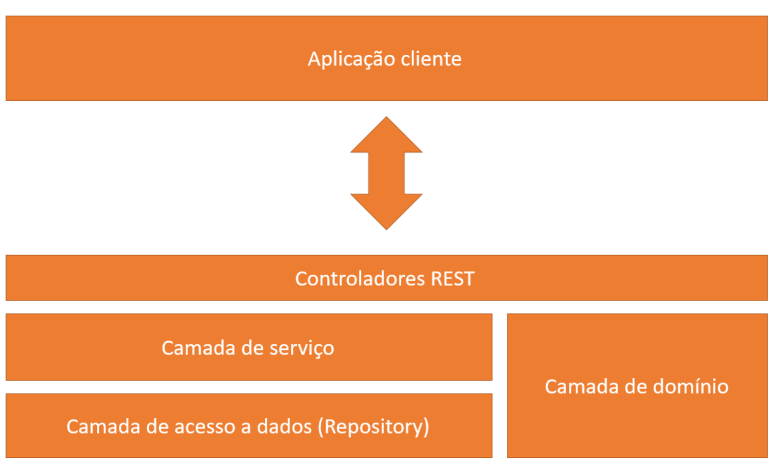
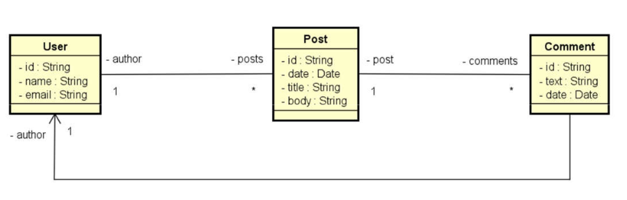
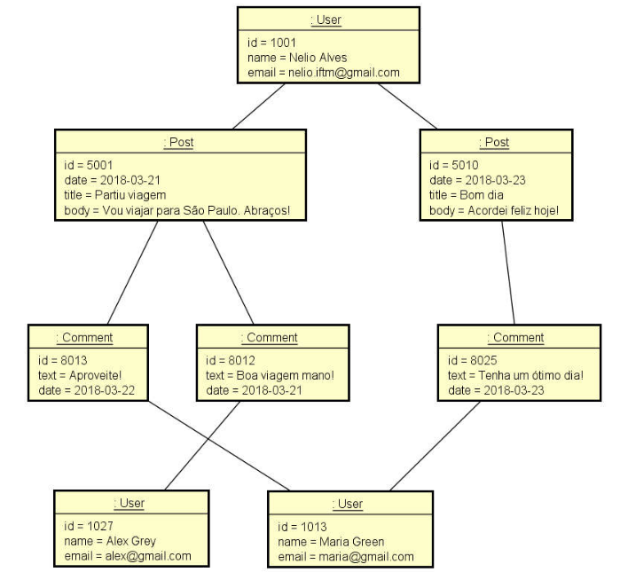

# Projeto de API REST com Spring Boot e MongoDB

Este projeto é uma implementação de uma API RESTful utilizando Spring Boot, MongoDB e JPA/Hibernate. O objetivo deste projeto é compreender as principais diferenças entre o paradigma orientado a documentos e o paradigma relacional, implementar operações CRUD, refletir sobre decisões de design para um banco de dados orientado a documentos e realizar consultas com Spring Data e MongoRepository.

## Objetivo Geral

- Compreender as principais diferenças entre o paradigma orientado a documentos e o relacional
- Implementar operações de CRUD
- Refletir sobre decisões de design para um banco de dados orientado a documentos
- Implementar associações entre objetos:
  - Objetos aninhados
  - Referências
- Realizar consultas com Spring Data e MongoRepository

## Tecnologias Utilizadas

- Java 11
- Spring Boot 2.7.x
- MongoDB
- Spring Data JPA
- Hibernate
- Postman

## Arquitetura do Projeto


## Diagrama de Classes


## Diagrama dos Objetos



## Configuração do Ambiente

### Pré-requisitos

- Java 11 ou superior
- MongoDB instalado e em execução
- Maven instalado

### Configuração do MongoDB

Certifique-se de que o MongoDB está em execução na porta padrão (27017). Caso esteja usando uma configuração diferente, atualize o arquivo `application.properties` conforme necessário.

### Configuração do Application Properties

Configure a conexão com o MongoDB em `src/main/resources/application.properties`:

```properties
spring.data.mongodb.uri=mongodb://localhost:27017/seu_projeto_db  
```

## Rodando a Aplicação

- Clone o repositório

- Compile e execute a aplicação

```compile
mvn clean install
mvn spring-boot:run
```
## Contribuição

Contribuições são bem-vindas! Sinta-se à vontade para abrir issues ou enviar pull requests.

## Obrigado ;)